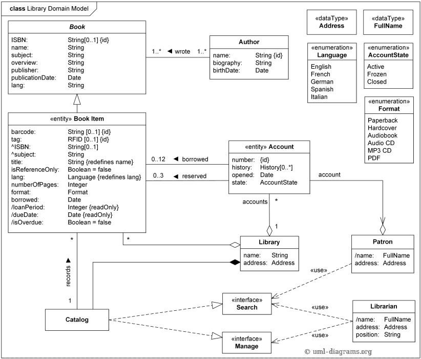

## UML: diagramy struktur

### Diagramy struktur

Diagramy strukturalne ilustrują statyczną strukturę elementów w systemie, pokazując relacje między obiektami. Prezentują one różne składniki systemu, takie jak klasy, obiekty, pakiety, moduły, fizyczne węzły, komponenty oraz interfejsy. Analogicznie do statycznych aspektów budynku, które obejmują istnienie i rozmieszczenie elementów takich jak ściany, drzwi czy okna, diagramy strukturalne ukazują podstawowe 'budulce' systemu informatycznego.

Siedem diagramów strukturalnych UML jest zorganizowanych wokół kluczowych elementów, które zazwyczaj występują podczas modelowania systemu.

Diagramy strukturalne, reprezentując strukturę systemu, znajdują szerokie zastosowanie w dokumentacji architektury oprogramowania. Na przykład, diagram komponentów szczegółowo opisuje podział systemu oprogramowania na komponenty i ukazuje zależności między nimi.

| Diagram Strukturalny          | Krótki Opis                                                                                      |
|-------------------------------|--------------------------------------------------------------------------------------------------|
| Diagram Struktury Złożonej    | Pokazuje wewnętrzną strukturę klasyfikatora, interakcje klasyfikatora z otoczeniem przez porty lub zachowanie współpracy.   |
| Diagram Wdrożeniowy           | Prezentuje zbiór węzłów i ich relacje, ilustrując statyczny widok wdrożenia architektury.        |
| Diagram Pakietów              | Grupuje powiązane elementy UML w kolekcję logicznie związanych struktur UML.                     |
| Diagram Profilu               | Przedstawia specjalizację metamodelu UML, definiując dodatkowe ograniczenia lub rozszerzenia.    |
| Diagram Klas                  | Pokazuje zestaw klas, interfejsów i współpracy oraz ich relacje, typowo znajdowane w modelowaniu systemów obiektowych.      |
| Diagram Obiektów              | Prezentuje zestaw obiektów i ich relacje, będące statycznymi migawkami instancji elementów znajdowanych w diagramach klas.  |
| Diagram Komponentów           | Ilustruje zestaw komponentów i ich relacje, przedstawiając statyczny widok implementacji systemu. |

### Pytania i odpowiedzi na temat UML:

1. **Jaka jest różnica między diagramem klas a diagramem obiektów?**
    - **Diagram klas** - prezentuje klasy i relacje między nimi w systemie, skupiając się na strukturze systemu poprzez pokazywanie klas, ich atrybutów, metod oraz związków, takich jak dziedziczenie czy asocjacje.
    - **Diagram obiektów** - jest instancją diagramu klas i pokazuje konkretne instancje klas (obiekty), ich wartości atrybutów i relacje z innymi obiektami, reprezentując stan systemu w danym momencie.

2. **Jaki kształt przyjmuje reprezentacja klasy?**
    - Reprezentacja klasy ma formę prostokąta podzielonego na trzy sekcje: nazwę klasy u góry, atrybuty w środkowej części i metody w dolnej sekcji.

3. **Co oznaczają dodane do atrybutów modyfikatory +, #, -, i ~?**
    - **+** (public) - element dostępny dla wszystkich klas.
    - **#** (protected) - element dostępny dla klasy, jej podklas i klas w tym samym pakiecie.
    - **-** (private) - element dostępny tylko wewnątrz klasy, w której jest zdefiniowany.
    - **~** (package-private) - element dostępny dla klas w tym samym pakiecie.

4. **Czym są:**
    - **Zależności (dependency):** relacje, gdzie zmiana jednego elementu może wpłynąć na inny element.
    - **Agregacje (aggregation):** specjalny typ asocjacji reprezentujący relację całość-część, gdzie części mogą istnieć niezależnie od całości.
    - **Asocjacje (association):** relacje między klasami, które łączą obiekty jednej klasy z obiektami drugiej.
    - **Generalizacje (generalization):** relacje dziedziczenia między superklasą a podklasą.
    - **Kompozycje (composition):** silniejsza forma agregacji, gdzie części nie mogą istnieć niezależnie od całości.

## Model Domenowy Biblioteki - Przykład Diagramu Klas UML

Model Domenowy Biblioteki jest narzędziem używanym podczas fazy analizy w celu zrozumienia domeny Zintegrowanego Systemu Bibliotecznego (ILS), zwanego także Systemem Zarządzania Biblioteką (LMS).

- Każdy element w bibliotece (książka, CD, DVD itp.) może posiadać unikalny numer identyfikacyjny, często zrealizowany za pomocą kodów kreskowych lub tagów RFID, co ułatwia powiązanie fizycznego przedmiotu z rekordem elektronicznym w katalogu.
- Diagram klas UML dla Modelu Domenowego Biblioteki ukazuje kluczowe klasy i ich relacje, jak na przykład atrybuty książek bibliotecznych, które mogą być dziedziczone z ogólnej klasy książki.
- W bibliotece określone są zasady dotyczące wypożyczania i rezerwacji materiałów, a także zasady dotyczące okresu wypożyczenia, które zależą od polityki biblioteki.
- Katalog Biblioteczny oferuje dostęp do informacji o zbiorach bibliotecznych, umożliwiając wyszukiwanie według autora, tematu czy formatu i wskazuje lokalizację materiałów.

Model ten pomaga zrozumieć, jak zintegrowany system biblioteczny wspiera zarządzanie i dostęp do zasobów bibliotecznych.

### Zadanie do wykonania:

Należy:

- Pobrać ze swojego repozytorium program z [Listy 4](https://github.com/krzysztofrewak/ppo/blob/main/classes/lab04.md) lub końcowy projekt zaimplementowany na zajęciach z **Projektowania i programowania obiektowego I**.
- Zastanowić się nad diagramem klas wybranego projektu; warto przejrzeć przykładowe diagramy na stronie [https://www.uml-diagrams.org/class-diagrams-examples.html](https://www.uml-diagrams.org/class-diagrams-examples.html).
- Za pomocą narzędzia [draw.io](https://draw.io) lub innego utworzyć diagram klas dla wybranego projektu.
- Gotowy schemat (najlepiej w formie graficznej oraz XML) dołączyć do repozytorium Git; zalecane jest uporządkowanie zadań w odpowiadającym im katalogach.