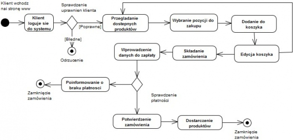
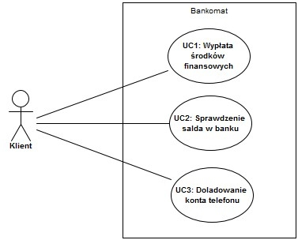
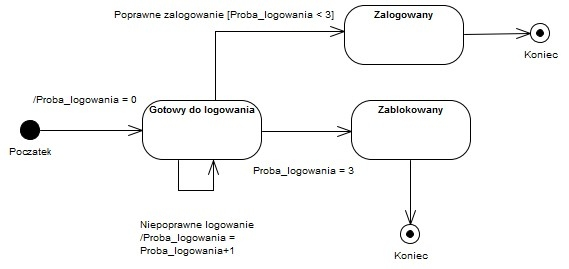
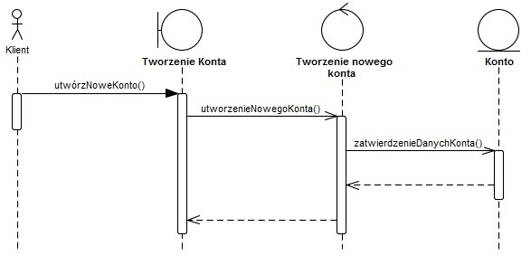
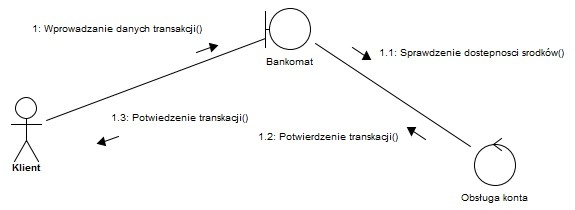

## UML: diagramy zachowań

#### Diagramy czynności (Activity Diagrams)

Diagramy czynności w UML służą do przedstawiania przepływu sterowania lub przepływu danych. Są one szczególnie użyteczne w modelowaniu procesów biznesowych lub sekwencji kroków w ramach określonego przepływu pracy. 

##### Elementy diagramu czynności:
- **Okręgi** reprezentują start (wypełniony kółko) i koniec (podwójne okręgi) procesu.
- **Prostokąty** przedstawiają działania lub kroki w procesie.
- **Romb** symbolizuje decyzję lub rozgałęzienie w przepływie.
- **Strzałki** wskazują kierunek przepływu procesu.

##### Zastosowanie:
Diagramy czynności są wykorzystywane do modelowania zachowań operacyjnych systemów, procesów biznesowych oraz przepływu pracy wewnątrz metod i funkcji.

#### Diagramy przypadków użycia (Use Case Diagrams)

Diagramy przypadków użycia UML służą do opisywania funkcji systemu oraz interakcji między systemem a jego użytkownikami (aktorami).

##### Zastosowanie:
Służą one do przedstawiania funkcjonalnych wymagań systemu, pokazując, co system ma robić z perspektywy użytkownika. Są kluczowe przy zbieraniu wymagań i komunikacji z interesariuszami.

### Diagramy stanów (State Diagrams)

Diagramy stanów ilustrują różne stany obiektu oraz przejścia między tymi stanami w odpowiedzi na zdarzenia.

#### Pytanie: Czy diagram stanów można zaprojektować dla każdego programu?

Teoretycznie tak, ale nie zawsze jest to praktyczne lub przydatne. Diagramy stanów są najbardziej użyteczne dla obiektów, których zachowanie jest wyraźnie wpływane przez ich stan lub które przechodzą przez znaczące zmiany stanu w czasie.

### Diagramy interakcji (Interaction Diagrams)

Diagramy interakcji, w tym diagramy sekwencji i diagramy komunikacji, służą do przedstawiania sposobu, w jaki grupy obiektów współpracują do realizacji pewnej funkcjonalności.

#### Do czego służą:

- **Diagramy sekwencji** Diagramy sekwencji w UML są dynamicznymi diagramami, które szczegółowo przedstawiają, jak obiekty w systemie komunikują się między sobą w kontekście konkretnego przypadku użycia lub procesu. Kluczowym aspektem diagramów sekwencji jest ukazanie interakcji między obiektami w porządku chronologicznym, co pozwala na zrozumienie przepływu kontroli w aplikacji lub systemie.

- **Diagramy komunikacji** Diagramy komunikacji, znane również jako diagramy współpracy, są jednym z typów diagramów interakcji w UML. Ilustrują one, jak obiekty w systemie współdziałają ze sobą do realizacji określonych zadań, jednak skupiają się bardziej na relacjach i powiązaniach między obiektami niż na porządku czasowym interakcji.

Wykorzystując te diagramy, inżynierowie mogą lepiej zrozumieć, jak komponenty systemu współdziałają, co jest kluczowe przy projektowaniu złożonych systemów.

### Zadanie do wykonania:

Należy:

- Pobrać ze swojego repozytorium program z [Listy 7](https://github.com/krzysztofrewak/ppo/blob/main/classes/lab07.md) zaimplementowany na zajęciach z **Projektowania i programowania obiektowego I**.
- Zastanowić się nad diagramem zachowań wybranego projektu; warto przejrzeć przykładowe diagramy:
  - [Diagramy czynności (Activity Diagrams)](https://www.uml-diagrams.org/activity-diagrams.html)
  - [Diagramy stanów (State Machine Diagrams)](https://www.uml-diagrams.org/state-machine-diagrams.html)
  - [Diagramy przypadków użycia (Use Case Diagrams)](https://www.uml-diagrams.org/use-case-diagrams.html)
  - [Diagramy sekwencji (Sequence Diagrams)](https://www.uml-diagrams.org/sequence-diagrams.html)
- Za pomocą narzędzia [draw.io](https://draw.io) lub innego utworzyć diagram zachowań dla wybranego projektu.
- Gotowy schemat (najlepiej w formie graficznej oraz XML) dołączyć do repozytorium Git; zalecane jest uporządkowanie zadań w odpowiadającym im katalogach.

Zachęcam do eksploracji wymienionych zasobów, aby uzyskać lepsze zrozumienie różnych typów diagramów i ich zastosowań w kontekście wybranego projektu.
